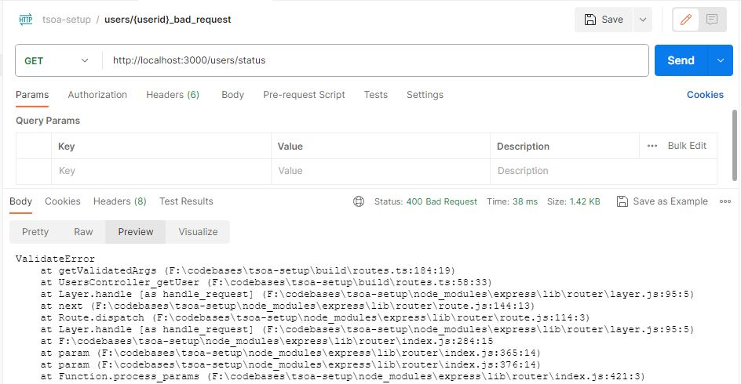
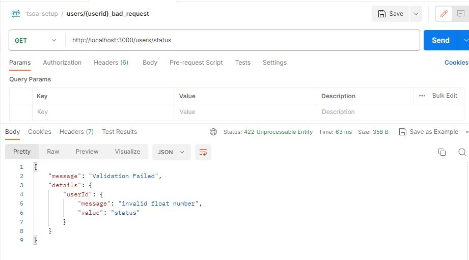

### tsoa starter
*   Re-do of official tsoa documentation walk through

### How to force error for error handling
*   Use following or similar
http://localhost:3000/users/status

As in following

### Error production

